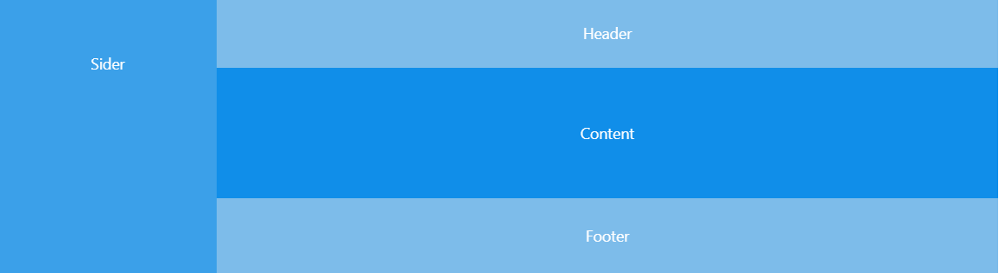

# UI设计

## 整体设计

本项目前端设计采用蚂蚁金服[Ant Design](https://ant.design/index-cn)UI设计框架深色主题。

### 布局

采用的整体布局如下：

Sider包含logo图片与侧边栏菜单，侧边栏菜单根据登录用户权限自动生成；

Header包含邮件、通知、用户头像框三图标，位于右上角，点击头像框图标可进入选项菜单；

Content为主要部件，根据路由不同，由Switch选择器渲染不同组件；

Footer为注脚，标注版权信息；

### 组件设计

所有Content内显示组件，均采用[Card卡片](https://ant.design/components/card-cn/)作为第一容器，用以承载文字、图片、表格、统计图等，在卡片外用[Grid栅格](https://ant.design/components/grid-cn/)限定卡片大小及间隔，卡片与Content边缘采用{margin: 3%}留出间距。